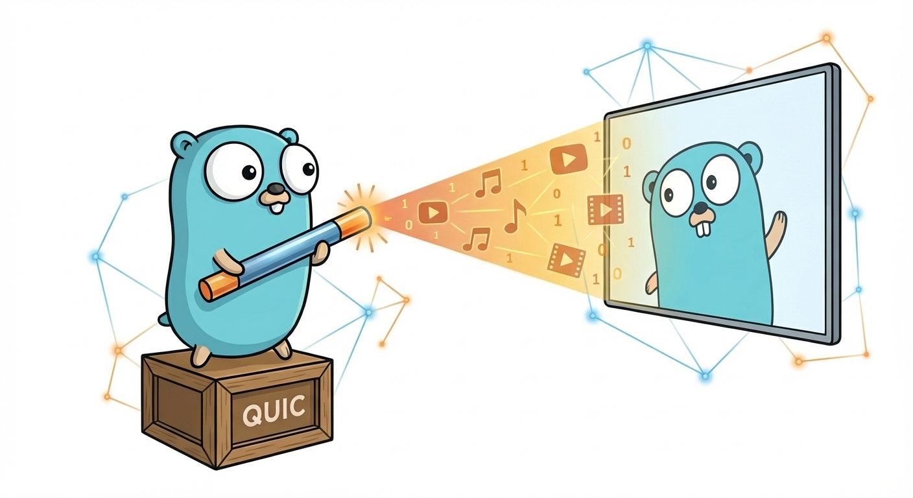

<h1 align="center">
  
   
  OpenScreen Go
</h1>
<h4 align="center">A pure Go implementation of the OpenScreen Protocol</h4>

  <a href="https://www.w3.org/TR/openscreen-network/">Network Spec</a> |
  <a href="https://www.w3.org/TR/openscreen-application/">Application Spec</a>

  

 

### Features

- OpenScreen Protocol Network Layer
  - QUIC transport with ALPN negotiation
  - mDNS discovery and advertisement
  - PSK authentication (SPAKE2)
  - Agent fingerprint verification
- Pure Go, no Cgo

### Roadmap

- [ ] Complete Rust interoperability testing
- [ ] WebRTC transport
- [ ] Application protocol expansion

### License

MIT License - see [LICENSE](../LICENSE) for full text
